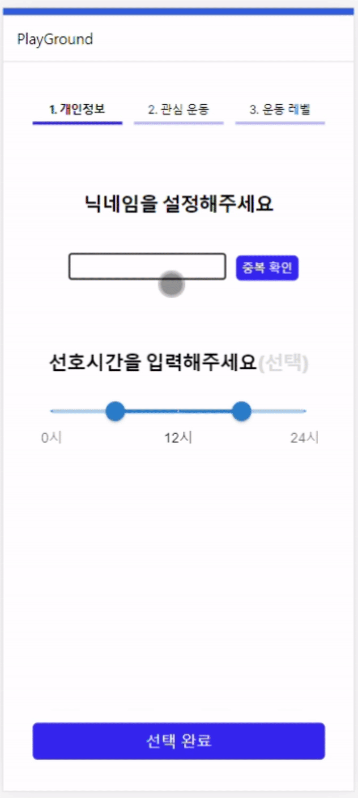
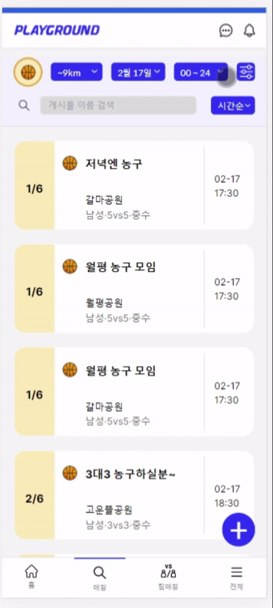
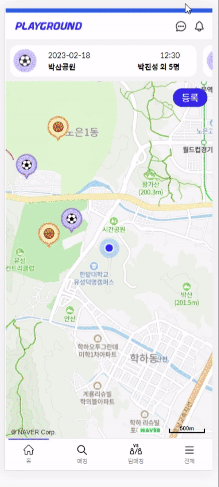
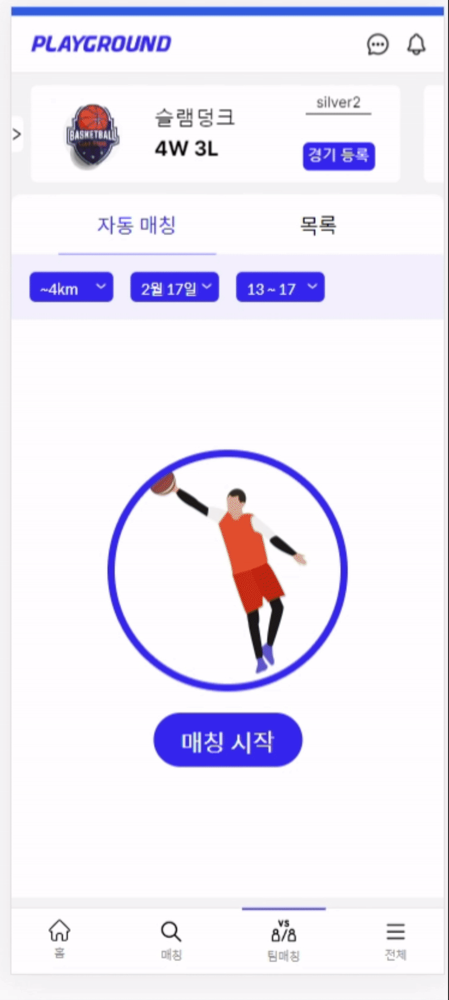
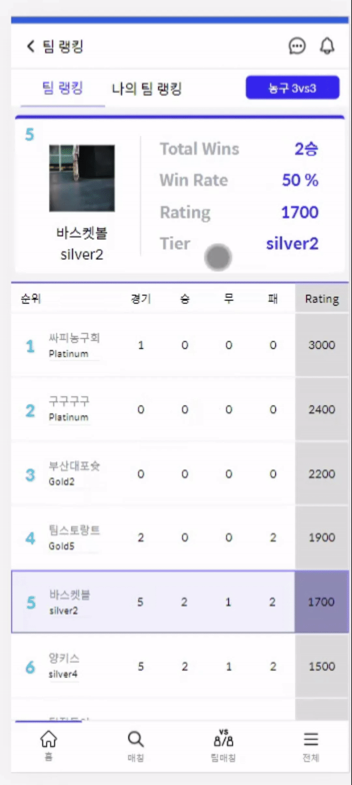
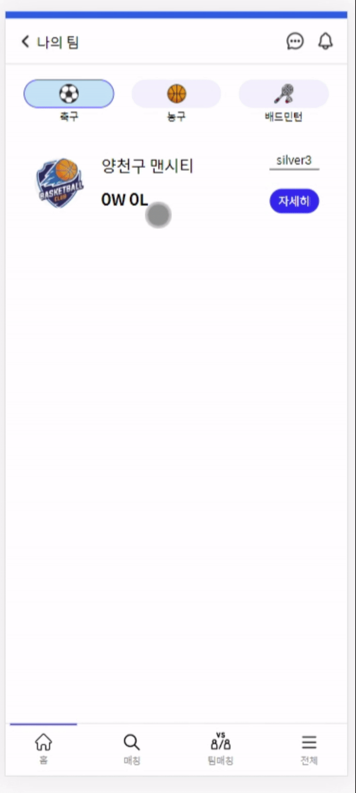

# PLAYGROUND
소셜 운동 매칭 서비스

   

# 목차
1. [결과물](#결과물)
2. [서비스 화면](#서비스-화면)
3. [주요 기능](#주요-기능)
4. [개발 환경](#개발-환경)
5. [기술 소개](#기술-소개)
6. [설계 문서](#설계-문서)
7. [팀원 소개](#팀원-소개)

   

# 결과물
- 📽 [UCC](https://youtu.be/9v1aKx9SDYE)
- 🎤 [중간 발표 PPT](https://drive.google.com/file/d/1mAaGPRllI2iS1Ac5wJBIb7swqCGSx22H/view?usp=share_link)
- 🎤 [최종 발표 PPT](https://drive.google.com/file/d/14RB6TlOET-WFh-uMFLxWAgyqUoOgS4_n/view?usp=sharing)
- 🎤 [경진 대회 PPT](https://drive.google.com/file/d/1_WZiilyOwnRf2_PTe9Yy2cUDVFD9HuZ1/view?usp=sharing)

   

# 서비스 화면

## ✅회원 가입

 

 

- 카카오 로그인 성공 시, 서비스에 등록된 회원이 아니라면 회원가입 진행
- 닉네임, `선호 운동 종목`, 종목 별 나의 `운동 수준`, `선호 시간대` 입력
- 입력된 정보를 통해 `서비스를 더욱 원활하게 이용`할 수 있음

   

## 🕒실시간 운동 모임
 

<상대방 시점에서 보이는 것도 넣어야함>
 

- `현재 시각으로 부터 30분` 이내에 생성된 실시간 운동 모임이 지도에 표시됨
- 아이콘 클릭 시 운동 모임의 `상세 정보 확인 가능`
- 우측 상단의 등록 버튼을 눌러 원하는 운동 선택
- 지도를 클릭하여 등록할 위치 조정 가능

   

## 🏃‍♂️개인 간 운동 모임
 

 

- `현재 위치 기반 0~10km` 까지 거리 설정 가능
- `일자`, `시간`, `게임 종류`, `게임 시간`, `성별` 필터 제공
- `시간 순`, `인원 순`, `거리 순`으로 검색된 모임 정렬 가능

 

<여기에 5/6인 모임방 들어가면 채팅방 생성되는 gif가 필요해요>
<여기에 채팅하고있는 gif가 필요해요>

- `인원이 가득 차게되면` 해당 모임의 `채팅방`이 생성
- 채팅 방에서 `실시간으로 소통` 가능

   

## 💭실시간 채팅

 

 

- 운동 모임, 또는 팀 채팅방에서 사람들과 채팅 가능

   

## 👨🏼‍🤝‍👨🏼팀 생성

 

 

- 전체 목록의 `팀 생성 탭`, 혹은 `팀 매칭 페이지`에서 팀 생성 가능
- `운동 종목`을 선택, `친구를 추가`하고 `팀 정보를 입력`하여 팀 생성
- 팀 생성 시 `팀 채팅방`도 같이 생성됨

   

## 🆚팀 매칭

 

 

- `경기 등록 버튼`을 클릭
- `날짜`, `장소`, `선호 시간대` 선택 후 등록 완료 버튼 클릭

 

 

- 자신이 속한 팀 중 원하는 팀을 선택, 필터에서 매칭 조건을 선택하고 `매칭 시작 버튼` 클릭
- 조건에 맞는 팀과 매칭되면 `알림`이 뜸

   

## 📑매칭 목록

 

 

- `자신이 참여한 모든 운동 모임` 확인 가능
- ">" 버튼 클릭 시 `매칭 상세 정보 확인 가능`
- `팀 매칭 정보` 확인 가능

   

## 🏆팀 랭킹

 

 

- `레이팅`, `승`, `무`, `패` 순으로 `정렬`하여 `팀`의 `순위 확인` 가능
- `우측 상단의 필터`에서 `운동 종목`과 `게임 종류` 선택 가능
- `팀을 클릭`하여 `상세 정보 `확인 가능
- 상단 탭을 `나의 팀 랭킹으로 전환` 시 `나의 팀의 순위`도 확인 가능

   

## ⚾나의 팀

 

 

- `내가 속한 팀의 목록` 확인 가능
- 팀을 클릭하면 `팀의 상세정보` 확인 가능

   

# 주요 기능
- ### 1. 실시간 지도
  
  - 공원마다 현재 인원이 어떤 운동으로 몇명 등록되어 있는지 확인할 수 있어요.
  - 농구, 축구, 배드민턴 중 내가 하고 싶은 운동에 사람이 부족할 때 지도에 표시를 남겨 인원을 모집할 수 있어요

 

- ### 2. 개인 매칭
  
  - 원하는 거리, 시간 등을 설정하고 버튼 한번으로 간편하게 같이 운동할 사람을 모집할 수 있어요.
  - 직접 운동 인원을 모집하는 게시글을 올려 같이 운동할 사람의 참여를 유도할 수 있어요.

 

- ### 3. 팀 매칭 & 랭킹
  
  - 내 팀과 수준이 비슷한 팀을 찾아서 매칭시켜줘요.
  - 내 팀이 얼마나 잘하는지 알고 싶지 않나요? 팀 랭킹을 통해 우리 팀의 순위를 알 수 있어요.

 

- ### 4. 실시간 채팅 & 알림
  
  - 사용자가 직접 초대하는 대신 매칭된 인원, 참여한 팀에 대해 자동으로 채팅방을 생성해줘요.
  - 매칭이 완료되면 화면 중앙에 알림이 표시돼요.

   

# 개발 환경

## ⚙ Management Tool
- 형상 관리 : Gitlab
- 이슈 관리 : Jira
- 커뮤니케이션 : Mattermost, Webex, Notion, Discord
- 디자인 : Figma, PowerPoint, MiriCanvas

 

## 💻 IDE
- Visual Studio Code `1.75.1`
- IntelliJ `IntelliJ IDEA 2021.2.4(Ultimate Edition)`

 

## 📱 Frontend
- React `18.2.0`
- React-redux `8.0.5` Redux `4.2.0` @Reduxjs/toolkit `1.9.1`
- React-Query `3.39.3`
- React-Router `6.7.0`
- Typescript `4.9.3`
- TailwindCSS `3.2.4`
- Vite `4.0.0`
- Firebase `9.17.1`
- Library
  - moment `2.29.4`
  - swiper `9.0.3`
  - redux-persist `6.0.0`
  - react-calendar `4.0.0`
  - react-hook-geolocation `1.1.0`
  - @types/navermaps `3.6.1`
  - vite-plugin-mkcert `1.12.0`
- Android Studio
- XCode
- VMWare
- Flutter

 

## 💾 Backend

- Springboot `2.7.8`, `3.0.2`
- Lombok
- Spring Data JPA 
- Spring Data Redis(lettuce)
- Spring Web
- Spring cloud(spring cloud gateway, spring cloud eureka, spring cloud config server) `3.1.3`
- QueryDSL
- webflux, netty
- Springdoc-openapi-starter-webmvc-ui `2.0.0`
- Oauth2
- WebSocket
- Redis
- MySql
- Swagger `3.0.0`
- SSL
- CertBot(CA Certificates)`

   

# 기술 소개
- 웹 기반 하이브리드 어플리케이션
  - `Flutter`를 활용하여 웹 및 앱 플랫폼 모두 사용 가능

   
- 사용자 알림
  - `Firebase Cloud Message`를 이용하여 사용자에게 필요한 알림 제공

   
- 실시간 채팅
  - `WebSocket`을 통하여 서버/클라이언트 통신 구현
  - `Stomp` 메세지 브로커를 활용하여 1:N의 관계 구축
  - `Redis`를 활용하여 채팅방을 유지하고 여러대의 채팅 서버간에 메세지를 주고 받음

   
- 필터링
  - 사용자가 원하는 `조건`으로 `검색`하면 원하는 결과를 얻을 수 있도록 함

   
- 자동 매칭
  - `ELO알고리즘` 기반 레이팅 시스템을 사용하여 비슷한 수준의 팀끼리 매칭될 수
   있도록 함

    
- 카카오 로그인
  - `OAUTH2` 인증을 이용해 불필요한 개인정보 입력 최소화

   
- CI/CD
  - Gitlab과 Jenkins 파이프라인을 서로 `동기화` 시켜 `실시간`으로 빌드 상황을 볼 수 있음
  - Jenkins 파이프라인을 `병렬`로 실행하여 빌드 시간을 단축 시킴

   
- Spring Cloud Gateway
  - 하나의 주소로 서버에 접속할 수 있도록 `패킷 분배`
  - 한가한 서버에게 업무를 배정하여 효율성을 증가시킬 수 있도록 `로드밸런싱`
  - 특정 사용자의 요청을 차단하여 `해킹 공격 방어`

   
- 해킹 대응
  - `Docker Hub`에 이미지를 업로드하고 이를 활용하여 재설치 시간을 단축
  - 해킹 서버를 받은 서버가 작동이 불가능하면 명령어 하나만으로 `자동으로 모든 서비스를 정상화`
  - Jenkins를 사용하지 않아야 할 때 `명령어 하나만`으로 수동 CI/CD 가능하도록 `Shell script`로 구현

   

# 설계 문서

## 🎨 와이어프레임
[Figma](https://www.figma.com/file/YlOB3Ah579DUXWWMRReYjI/Team-project1?node-id=0%3A1&t=dxhLoLmUctD57gOP-1)
 

  

## 📃 기능 명세서
[Notion](https://sparkly-condition-4b3.notion.site/75a8fd7421be41dda09b7c1927d26d3e?v=a84d49ac8707462e8181598f300b88a8)

  

## 📝 API 명세서
[Notion](https://sparkly-condition-4b3.notion.site/96b451020ce54da5b859c9a659e4501b?v=4d6c3993eb574431b168ed3a2fca8ae8)

  

## 📏 ERD

  

## 📐 시스템 아키텍처

  

# 팀원 소개
## ⛑구구구구 취업9조대⛑

|**[이경택](https://github.com/skylove308)**|**[이강윤](https://github.com/GangYunGit)**|**[박진성](https://github.com/ssg-js)**|**[김아린](https://github.com/rin-k645)**|**[김태훈](https://github.com/IT-magician)**|**[유도열]()** |
| :---------------------------------------------------------------------------------------------------------------------------: | :---------------------------------------------------------------------------------------------------------------------------: | :---------------------------------------------------------------------------------------------------------------------------: | :---------------------------------------------------------------------------------------------------------------------------: | :---------------------------------------------------------------------------------------------------------------------------: | :---------------------------------------------------------------------------------------------------------------------------: |
|  |  |  |  |  |  |
|Frontend|Frontend|Frontend|Backend|Backend|Backend|

   

## 😎 역할 분담
**Frontend**

- 박진성 : UX/UI 설계, 실시간 매칭 페이지, 영상 제작
- 이강윤 : UX/UI 설계, 회원관리 및 실시간 채팅 페이지, 회의록 작성
- 이경택 : 기획 및 UX/UI 설계, 실시간 운동 모임 페이지, 로그인, 실시간 알림, 채팅, 랭킹, 비동기 데이터 처리, 발표

**Backend**

- 유도열 : 실시간 채팅
- 김아린 : DB설계 및 구축, 운동 모임, 팀 통계/매칭, PPT 제작
- 김태훈 : 아키덱쳐 설계, CI/CD 및 MSA 아키텍처 구축, OAUTH 소셜 로그인, 회원 관리, Hybrid App 개발
