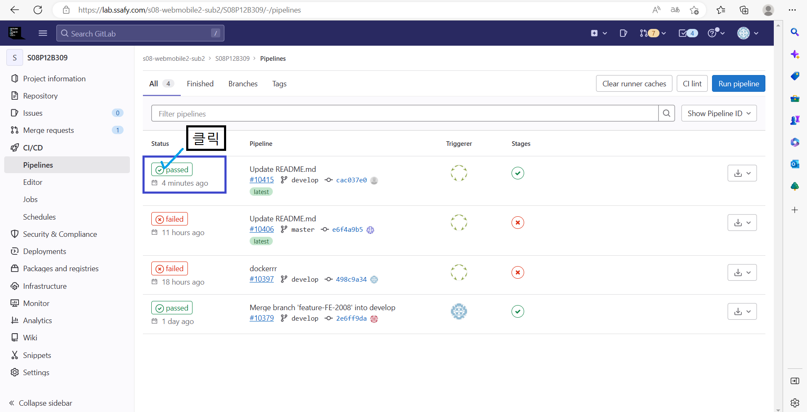
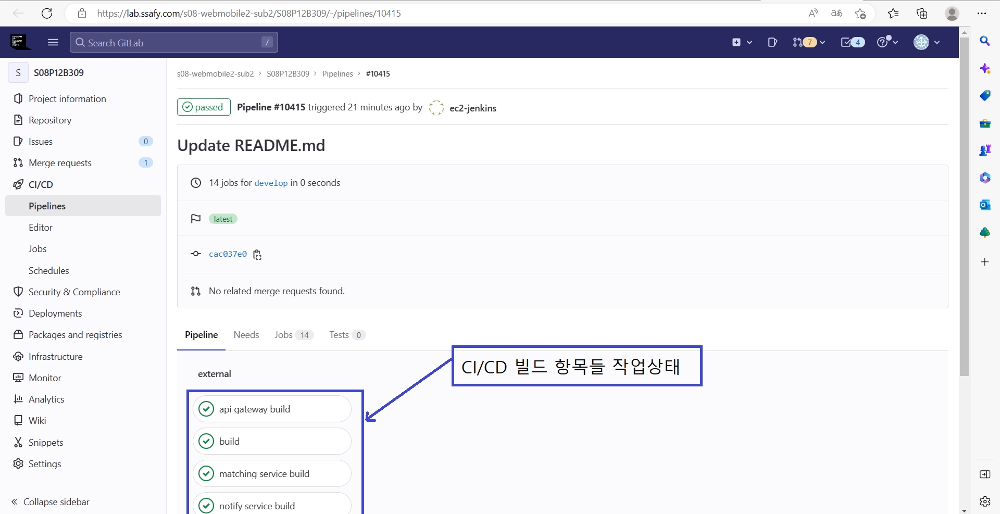

# Playground Develop 브랜치
  
spring, react 프로젝트와 docker 스크립트가 있음.  
이 브랜치는 gitlab 파이프라인으로 결과를 볼 수 있음.

how can i see the process of jenkins building status on gitlab?
: 'gitlab의 좌측메뉴(access_token 가져오는 메뉴) -> CI/CD -> Pipelines'

+ status를 누르면 상세 빌드를 볼 수 있음.
  
  
--> 기대효과 : 팀원들이 gitlab으로만으로도 ci/cd 성공여부를 확인할 수 있음.  

